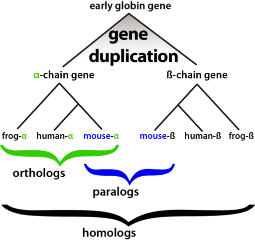

# Gene_annotation_tutorial

This tutorial is designed to guide you through the annotation of a specific gene of interest

## Background

Genome sequencing is a powerful tool in modern genomics. But the DNA sequence alone is not particularly helpful! We want to know -*Where* are the genes are in the genome -*What* are the genes doing -*Why* are these genes important

### Gene Annotation

The first step is **Gene Annotation** in which we uncover where genes are located in the genome. For a review of genome annotation methods see <https://www.nature.com/articles/35080529> "Genome annotation: from sequence to biology" by Lincoln Stein

Gene annotation methods find "Open Reading Frames" or ORFs. ORFs have the structure of a gene (start codon, stop codon etc). *Not all ORFs are real genes* and therefore some ORFs will never make a protein under any conditions. To try and identify real genes (genes that actually result in a protein) some software use high quality reference genomes or expression data.

The method used in the y1000+ project does not use a reference genome or expression data sets. Instead, it asks does the gene "look like" a yeast gene. This means that, while our models are getting better and better, the gene annotations are still hypotheses and some of them may not make real proteins

### Functional Annotation

The second step is **Functional Annotation** in which we try and determine the function of the proteins encoded in the genes we have annotated. Functional annotation is based on comparing the sequence and/or structure of a gene/protein to a known reference. Remember Structure = Function.

If I were to hand you the sequence of one gene and asked you "What does this gene do?" you would probably head to the Blast Database <https://blast.ncbi.nlm.nih.gov/Blast.cgi> . There you would search for proteins that have a similar sequence to yours. Then from those you may try to infer a function.

On a larger scale we have done this with the y1000+ dataset using two databases of reference proteins.

We used InterPro - "InterPro provides functional analysis of proteins by classifying them into families and predicting domains and important sites. To classify proteins in this way, InterPro uses predictive models, known as signatures, provided by several different databases (referred to as member databases) that make up the InterPro consortium"

InterPro gives information about the domains within a protein

We also used *KEGG* or the *Kyoto Encyclopedia of Genes and Genomes* "KEGG is a database resource for understanding high-level functions and utilities of the biological system, such as the cell, the organism and the ecosystem, from molecular-level information, especially large-scale molecular datasets generated by genome sequencing and other high-throughput experimental technologies."

For the y1000+ genomes we have annotated the coding sequences (cds) using KEGG.

### KEGG Results

The KEGG files look like this:

```         
g000045.m1  K07390
g000046.m1  K00916
g000047.m1  K11786
g001632.m1  K07390
g001633.m1  K06662
g001665.m1  K01702
g001665.m1  K01703
g001665.m1  K01704
```

The first column is the gene name. In this dataset there is a unique name for each gene within each species. Thee names, however, are **not** unique between species. Therefore species A could have g000045.m1 and species B could also have g000045.m1. This *does not* mean the genes are related in any way. They were the 45th gene annotated

The second column is the KEGG Orthology (KO). <https://www.kegg.jp/entry/K07390> . For example the orthology for K07390 indicates that this gene is most likely a "monothiol glutaredoxin." Explore the web entry to see all the information that can be found associated with each orthology.

There are several things to note about the result shown above - Some KEGG annotations are associated with more than one gene. For example, this species appears to have two genes that are monothiol glutaredoxins (K07390).

-   Some genes are associated with more than one KEGG orthology. For example the gene g001665.m1 has three KOs. These are 3-isopropylmalate dehydratase 3-isopropylmalate/(R)-2-methylmalate dehydratase large subunit 3-isopropylmalate/(R)-2-methylmalate dehydratase small subunit

    We can see that these three KOs are highly associated with each other. There are a couple of possibilities as to why this could happen

    First, the reference genomes could have three distinct genes that have a similar function and structure. In this species, however, there may be only 1 gene

    Second, it's also possible that the algorithm cannot distinguish between these three possible KOs and it is "similar enough" to be called all three.

The KOs are a great start for functionally annotating a gene in our dataset. BUT there are still flaws.

### Limitations of KEGG

Based on the reference sequences, the KEGG database constructs a "profile" of each protein using a Hidden Markov Model (HMM). (for more on HMMs see <https://www.ebi.ac.uk/training/online/courses/protein-classification-intro-ebi-resources/what-are-protein-signatures/signature-types/what-are-hmms/> )

This profile is then used to find matches within our target genome.

Imagine you are an alien and just got to earth. As a part of your research on earth you are tasked with classifying a basket full of food into their respective categories. Your knowledge of the categories comes from a set of reference photos.

Issues could arise if your reference photos are *too specific*. Imagine all the reference photos for "apples" are pictures of small green apples. Then when you pick up a big red apple, you may not realize that this is supposed to be an apple because it's not small and green.

Reference Set:

{width="71"}

{width="104"}

{width="104"}

Object to classify:

{width="155"}

Another issue could arise if your reference photos are *too general*. Imagine if you were given a reference set of photos for a Tangelo (a fruit that is a cross between a Tangerine and a Grapefruit). If you pick up either a Tangerine or a Grapefruit you may put them in the same category.

Reference Set:

{width="130"}

{width="90"}

{width="92"}

Object to classify (tangerine):

{width="173"}

Object to classify (Grapefruit):

{width="190"}

Both of these scenarios can occur in the annotation of the y1000+ genomes. Therefore we must *refine* the results of the KEGG analysis.

## Guided example of KEGG refinement

For this example we will be using the *XYL* genes. In 2022, members of the y1000+ group characterized the *XYL* genes in 332 budding yeasts. <https://www.biorxiv.org/content/10.1101/2022.06.10.495693v2.abstract>

XYL genes: XYL1 XYL

### STEP 1 - Identify starting refrence sequences

The first step is to identify a set of starting reference sequences. This could include - Reference sequences from the BLAST database/NCBI - A preliminary set of KEGG annotations - A set of previously identified sequences from a paper or collaborator

Protein sequences are typically better for this analysis than DNA sequences

In our case let's start with the KEGG database XYL1 - K17743 XYL2 - K05351 XYL3 - K00854

I searched for the KEGG annotations in our raw dataset and found this many sequences out of 1,154 species

| Xylose Gene | KEGG Orthology | Num of Seqs |
|-------------|----------------|-------------|
| XYL1        | K17743         | 1332        |
| XYL2        | K05351         | 1057        |
| XYL3        | K00854         | 105         |

### STEP 2 - Align reference seqs

Align the reference sequences

On the UNC Charlotte HPC this can be done as below

```         
ml mafft
mafft K17743.pep.fasta > K17743.pep.aligned.fasta
mafft K00854.pep.fasta > K00854.pep.aligned.fasta
mafft K05351.pep.fasta > K05351.pep.aligned.fasta
```

If you take a look at the aligned file for K05351 you will see that there is at least one sequence that is *too long*. That's fine for now, but we will need to address that later

### Step 3 - Build an HMM for each of the aligned sequences

This step will build the HMM profile which we will use to search our dataset.

```         
ml hmmer
hmmbuild K17743.pep.aligned.hmm K17743.pep.aligned.fasta
hmmbuild K05351.pep.aligned.hmm K05351.pep.aligned.fasta
hmmbuild K00854.pep.aligned.hmm K00854.pep.aligned.fasta
```

We now have our refined HMM profiles. The hope is that these are specific enough to our budding yeasts but not too specific!

### Step 4 - Search our annotations with the new HMM

Now we want to search all our annotation files with the HMMs we built

```         
#Loop through the annotation files saved in the annotations_pep_fixed directory

ls annotations_pep_fixed/*pep | while read line;
do 
#get the annotation file name without the leading folder names
file=$(basename $line); 
#run the HMMsearch and save the output (-o) and a tabular output (--tblout)
hmmsearch -o K00854/$file.out --tblout K00854/$file.tbl.out K00854.pep.aligned.hmm $line; done

ls annotations_pep_fixed/*pep | while read line; do file=$(basename $line); hmmsearch -o K17743/$file.out --tblout K17743/$file.tbl.out K17743.pep.aligned.hmm $line; done


ls annotations_pep_fixed/*pep | while read line; do file=$(basename $line); hmmsearch -o K05351/$file.out --tblout K05351/$file.tbl.out K05351.pep.aligned.hmm $line; done
```

### Step 5 - Determine a cutoff for the HMM Search

Because each HMM profile is different it is likely that the E-value cutoff for each search will be variable

For example see the HMM E-value distributions for our three searches. These values were extracted from the tabular output from the hmmsearch

For K00854 a histogram of the E.values shows that there is one peak around 1e-200. There is also another peak around 1e-15. We likely want only those that fall in the first peak


For K05351 the histogram shows *two* peaks. One that is around 1e-200 and another that is closer to 1e-100. Why this is occurring is unclear at this point but we likely want both peaks


For K17743 the histogram shows one clear peak and then lots of sequences around the bottom. The peak with the lowest values stretches from 1e-150 to 1e-200


Based on these distribution I decided to filter the results with the following cutoffs K00854 - 1e-70 (1 peak) K05351 - 1e-70 (2 peaks) K17743 - 1e-110 (1 peak)

### Step 6 - Get the sequences and look at the length distribution

I extracted each of the hits (sequences that pass the score threshold) as a fasta sequence and added it to a new FASTA file

| Gene | KO     | KO_hits | HMM_Hits |
|------|--------|---------|----------|
| XYL1 | K17743 | 1332    | 1355     |
| XYL2 | K05351 | 1057    | 2152     |
| XYL3 | K00854 | 105     | 1137     |

From this we can see that the XYL1 annotation counts did not change very much The XYL2 annotation doubled! This is likely due to the two peaks we included XYL3 annotation is greatly expanded.

Now let's check the length distribution of the sequences

We can use bash to get the length of every sequences

```         
awk '/^>/ {print; next; } { seqlen = length($0); print seqlen}' K00854.fasta > K00854.seqlen.txt
```

We are analyzing the sequence length because *sometimes* the annotations (the hypotheses about *where* a gene is are incorrect)

***K00854***

{width="317"}

Most sequences are around 600 amino acids long. However, you can see there are some really long, and some really short sequences

5 sequences are \< 200aa 8 sequences are \> 800aa

Let's take a closer look at the really short and really long sequences. To do this let's turn to a basic blast search on NCBI

Short Sequence example: \>yHMPu5000040958_metschnikowia_andauensis_201018 g008773.m1

{width="407"}

The blast results indicate that this is likely a xylulokinase that is only half of the length of the predicted sequence.

This could indicate that the gene is truly truncated OR it could indicate that the gene was mis-annotated.

Long Sequence example: \>yHMPu5000034672_blastobotrys_parvus_160519 g001238.m1

{width="369"}

The blast results indicate that this sequence contains *both* a xylulokinase and aAcyl-coenzyme A oxidase 2.

In this case these sequences may need additional editing by hand. Likely at this point we would remove these and save them for subsequent editing by hand

***K17743***

{width="404"}

In this case the distribution of lengths is very concentrated around 300aa

There is 1 sequence under 200aa There are 2 sequences over 400aa

The short sequence (yHMPu5000034631_martiniozyma_abiesophila_170307.haplomerger2 g002653.m1) is similar to the above scenario in which the gene is only partial

{width="460"}

The long sequence ( yHMPu5000034950_citeromyces_hawaiiensis_170307.haplomerger2 g005680.m1) is similar in that there are clearly two genes annotated in the long sequence. This case is slightly different in that part of each gene is missing. You can tell because the beginning/end of the annotated genes are missing. In this case we would need to go back into the genome to get the correct sequence

{width="397"}

***K05351***

{width="388"}

Similarly here we have a few long sequences and a few short sequences. The scenario is the same as in the above examples

Therefore, we will be taking only sequences that are 3 or fewer standard deviations from the mean. The removed sequences will be retained. These sequences likely need to be addressed by hand

| Gene | KO     | KO_hits | HMM_Hits | Removed Hits | Remaining |
|------|--------|---------|----------|--------------|-----------|
| XYL1 | K17743 | 1332    | 1355     | 16           | 1339      |
| XYL2 | K05351 | 1057    | 2152     | 23           | 2129      |
| XYL3 | K00854 | 105     | 1137     | 25           | 1121      |

### Step 7 - OrthoGroup Analysis

We may be able to further breakdown the results within each group as separate groups of Orthologs within the budding yeasts.

We may be able to distinguish orthologs from paralogs using evolutionary analyses. To illustrate the difference between orthologs and paralogs see the image below



Image from: <https://bitesizebio.com/26762/homology-terminology-never-say-wrong-word/>

Orthogroup analysis has been previously conducted using *every genome* in the y1000plus dataset. Therefore, we can just ask, what orthogroup does each sequence analyzed belong to. Orthogroup assignments are named after an arbitrary number and do not imply function

| KEGG   | Orthogroup 1 (\# of sequences) | Orthogroup 2 (\# of sequences) |
|--------|--------------------------------|--------------------------------|
| K00854 | OG0003347 (1,063)              | OG0007516 (51)                 |
| K05351 | OG0000277 (2,128)              | OG0000791 (3)                  |
| K17743 | OG0000677 (2,343)              | *NA*                           |

**K05351 results**

K05351 falls into two Orthogroups (OGs). One has only three sequences - OG0000791. This OG is found in

-   yHMPu5000038352_candida_sergipensis_180604

-   yHMPu5000035276_Candida_spandovensis_SPADES

-   yHMPu5000037239_wickerhamiella_brachini_210210

Each of these genomes *also* has a representative sequence in the other OG (OG0000277). Interestingly these three species share a common ancestor. I appears as though there was a duplication event (duplciating OG0000277) in this common ancestor resulting in the creation of a paralog (OG0000791)


As for the other orthogroup OG0000277 we can look at the annotations for *Saccharomyces cerevisiae* to get some guidance. Blast suggests that the three genes that fall in this OG are SOR1, SOR2 and XYL2. Interestingly, recent work suggests that SOR1, SOR2, and XYL3 may have the same function and have a complicated history that includes multiple duplication and loss events throughout the tree.

**K00854 Results - TBD**

**K17743 Results**
